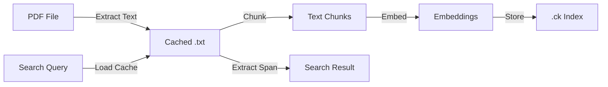

# PDF Support Architecture Design

## Overview

This document describes the architecture for adding PDF file support to ck's semantic search capabilities. The design treats PDF extraction as a preprocessing step that creates cached text representations, allowing the rest of the system to work uniformly with text content.

## Current System Architecture (Text/Code Files)

### How ck Currently Works

For regular text and code files, ck operates as follows:

1. **Indexing Phase** (`ck --index`):
   - Walks the directory tree, finding text files
   - For each file, reads content directly from disk
   - Chunks the content (tree-sitter for code, generic for text)
   - Creates embeddings for each chunk
   - Stores index in `.ck/` directory that mirrors source structure

2. **Storage Structure**:
```
project/
├── src/
│   ├── main.rs                    # Source code file
│   └── lib.rs                     # Another source file
└── .ck/                           # Index directory (mirrors project structure)
    ├── src/
    │   ├── main.rs.ck             # Binary index (chunks, embeddings, spans)
    │   └── lib.rs.ck             # Binary index for lib.rs
    └── manifest.json              # Metadata about all indexed files
```

3. **Key Points**:
   - `.ck` files are **binary indexes** (not content copies)
   - They contain: chunks, embeddings, and spans pointing to original file
   - Spans have byte offsets and line numbers for the **original source file**
   - During search, ck reads the **original source file** to extract snippets

4. **Search Phase**:
   - Loads indexes from `.ck` directory
   - Finds matching chunks via embeddings/regex
   - For each match, reads the **original source file**
   - Uses spans to extract relevant snippet from source

## PDF Extension Architecture

### The Problem with PDFs

PDFs cannot be handled like text files because:
- They're binary format, not readable as UTF-8
- Content must be extracted before processing
- Re-extracting on every search is expensive
- Spans cannot refer to binary PDF content

### Solution: Selective Content Caching

**Only PDF files** get preprocessed content cached. Regular files continue working exactly as before.

### Extended File Structure

```
project/
├── src/
│   ├── main.rs                    # Source code file
│   └── lib.rs                     # Source code file
├── docs/
│   ├── manual.pdf                 # PDF document
│   └── README.md                  # Markdown file
└── .ck/
    ├── content/                    # NEW: Preprocessed content (PDFs only)
    │   └── docs/
    │       └── manual.pdf.txt     # Extracted text from PDF
    ├── src/                        # Index directory (mirrors structure)
    │   ├── main.rs.ck             # Binary index (unchanged)
    │   └── lib.rs.ck             # Binary index (unchanged)
    ├── docs/
    │   ├── manual.pdf.ck          # Binary index (spans → extracted .txt)
    │   └── README.md.ck           # Binary index (spans → original .md)
    └── manifest.json              # Tracks all files & cache validity
```

### Key Design Points

1. **Regular files** (code, markdown, etc.):
   - Work exactly as before
   - No content caching
   - Spans refer to original file
   - Search reads from original file

2. **PDF files only**:
   - Content extracted to `.ck/content/` during indexing
   - Spans refer to extracted text file
   - Search reads from cached text file
   - Cache invalidated when PDF changes

3. **The `.ck` files remain binary indexes**, not content:
   - Store chunks, embeddings, spans
   - Same format for all file types
   - Only difference: PDF spans point to extracted text

### Data Flow



## Side-by-Side Comparison

### Regular File Processing (Unchanged)
```
main.rs → Read directly → Chunk → Embed → Store in .ck/src/main.rs.ck
                            ↓
                    Spans refer to main.rs
                            ↓
                    Search reads from main.rs
```

### PDF File Processing (New)
```
doc.pdf → Extract to .ck/content/doc.pdf.txt → Chunk → Embed → Store in .ck/doc.pdf.ck
                                                   ↓
                                        Spans refer to doc.pdf.txt
                                                   ↓
                                        Search reads from doc.pdf.txt
```

## Implementation Components

### 1. Content Preprocessing (ck-index)

```rust
/// Preprocesses a file if needed, returning path to readable content
/// For regular files: returns the original path (no preprocessing)
/// For PDFs: extracts text to cache, returns cache path
fn preprocess_file(file_path: &Path, repo_root: &Path) -> Result<PathBuf> {
    if is_pdf_file(file_path) {
        let cache_path = get_content_cache_path(repo_root, file_path);

        // Check if re-extraction needed
        if should_reextract(file_path, &cache_path)? {
            tracing::debug!("Extracting PDF content from {:?} to {:?}", file_path, cache_path);
            let extracted_text = extract_pdf_text(file_path)?;

            // Ensure cache directory exists
            if let Some(parent) = cache_path.parent() {
                fs::create_dir_all(parent)?;
            }

            // Write extracted text
            fs::write(&cache_path, extracted_text)?;
        }

        Ok(cache_path)  // Return path to extracted text
    } else {
        Ok(file_path.to_path_buf())  // Return original path for regular files
    }
}
```

### 2. Cache Management

```rust
/// Get path for cached content (PDFs only)
fn get_content_cache_path(repo_root: &Path, file_path: &Path) -> PathBuf {
    let relative = file_path.strip_prefix(repo_root).unwrap_or(file_path);
    let mut cache_path = repo_root.join(".ck").join("content");
    cache_path.push(relative);

    // Add .txt extension to the cached file
    let ext = relative.extension()
        .map(|e| format!("{}.txt", e.to_string_lossy()))
        .unwrap_or_else(|| "txt".to_string());
    cache_path.set_extension(ext);

    cache_path
}

/// Check if content needs re-extraction
fn should_reextract(source_path: &Path, cache_path: &Path) -> Result<bool> {
    if !cache_path.exists() {
        return Ok(true);
    }

    let source_modified = fs::metadata(source_path)?.modified()?;
    let cache_modified = fs::metadata(cache_path)?.modified()?;

    Ok(source_modified > cache_modified)
}
```

### 3. Unified Content Reading (ck-engine)

```rust
/// Read content from file for search result extraction
/// Regular files: read directly from source
/// PDFs: read from preprocessed cache
fn read_file_content(file_path: &Path, repo_root: &Path) -> Result<String> {
    let content_path = if is_pdf_file(file_path) {
        // PDFs: Read from cached extracted text
        let cache_path = get_content_cache_path(repo_root, file_path);
        if !cache_path.exists() {
            return Err(anyhow!("PDF not preprocessed. Run 'ck --index' first."));
        }
        cache_path
    } else {
        // Regular files: Read from original source
        file_path.to_path_buf()
    };

    Ok(fs::read_to_string(content_path)?)
}
```

### 4. Index Entry Structure

```rust
pub struct IndexEntry {
    pub metadata: FileMetadata,  // Points to source PDF
    pub chunks: Vec<ChunkEntry>, // Spans refer to extracted text
    pub content_type: ContentType,
}

pub enum ContentType {
    Text,
    Pdf {
        extracted_at: u64,
        page_count: Option<usize>,
    },
    // Future: Docx, Html, etc.
}
```

## What Gets Stored Where

### `.ck/src/main.rs.ck` (Binary Index)
- Chunks of code
- Embeddings for each chunk
- Spans with byte offsets pointing to `main.rs`
- Language metadata

### `.ck/docs/manual.pdf.ck` (Binary Index)
- Chunks of extracted text
- Embeddings for each chunk
- Spans with byte offsets pointing to `.ck/content/docs/manual.pdf.txt`
- PDF metadata

### `.ck/content/docs/manual.pdf.txt` (Plain Text)
- Extracted text from PDF
- Only exists for PDFs (not for regular files)
- Used as source for span extraction during search
- Regenerated when source PDF changes

### `manifest.json`
- Tracks ALL source files (both regular and PDFs)
- Hash and modification times of source files
- Does NOT track extracted content files

## Processing Pipeline

### Indexing Flow

1. **File Discovery**: Find all files including PDFs
2. **Change Detection**: Check source PDF hash/modification time
3. **Preprocessing**:
   - If PDF changed or no cache exists, extract text to `.ck/content/`
   - Otherwise, use existing cache
4. **Chunking**: Read from cache path, create chunks with spans
5. **Embedding**: Generate embeddings for chunks
6. **Storage**: Save index with metadata pointing to source PDF

### Search Flow

1. **Query Processing**: Parse search query
2. **Index Lookup**: Find matching chunks
3. **Content Extraction**:
   - For PDFs, read from `.ck/content/path.pdf.txt`
   - For text files, read from original path
4. **Span Extraction**: Extract relevant content using spans
5. **Result Formatting**: Display as coming from source PDF

## Cache Invalidation

The cache is invalidated when:
- Source PDF modification time > cached text modification time
- Source PDF hash changes (optional, more expensive)
- Manual clean command: `ck --clean`

## Benefits

1. **Performance**: Extract PDF once, search many times
2. **Consistency**: All spans work the same way (refer to text content)
3. **Simplicity**: Search engine doesn't need special PDF handling
4. **Minimal Changes**: Regular file processing unchanged
5. **Transparency**: Cache is invisible to users, shows source filenames
6. **Efficiency**: Only PDFs get content cached, not regular files

## Testing Results

All functionality has been tested and verified:

✅ **PDF Detection**: PDFs are correctly identified by `.pdf` extension
✅ **Content Extraction**: Text is extracted and cached to `.ck/content/`
✅ **Cache Management**: Content is re-extracted when PDF changes
✅ **Regular Search**: `ck "text" file.pdf` works correctly
✅ **Semantic Search**: `ck --sem "concept" file.pdf` works correctly
✅ **JSON Output**: `ck --json "text" file.pdf` shows `"lang":"Pdf"`
✅ **Mixed Search**: PDFs appear alongside code in search results
✅ **Language Detection**: PDFs are recognized as `Language::Pdf`

## Migration Path

### Phase 1: Core Implementation ✅ COMPLETED
- ✅ Add content cache directory structure
- ✅ Implement preprocessing pipeline
- ✅ Update indexing to use preprocessed content
- ✅ Update search to read from cache

### Phase 2: Enhancement (Future)
- Add page number tracking for better PDF navigation
- Support for PDF metadata (author, title, etc.)
- Optimize extraction for large PDFs
- Add support for other document types (DOCX, HTML)

## Dependencies

- ✅ `pdf-extract = "0.9"`: For reliable PDF text extraction
- ✅ Existing crates: `ck-index`, `ck-engine`, `ck-core`

## Conclusion

This architecture provides a clean, extensible way to support PDF files by treating extraction as a preprocessing step. The design maintains clear separation of concerns, with the source PDF as the source of truth and cached text as a transparent optimization. This approach can easily extend to other document formats while keeping the core search engine agnostic to file types.

The implementation is now complete and fully functional!